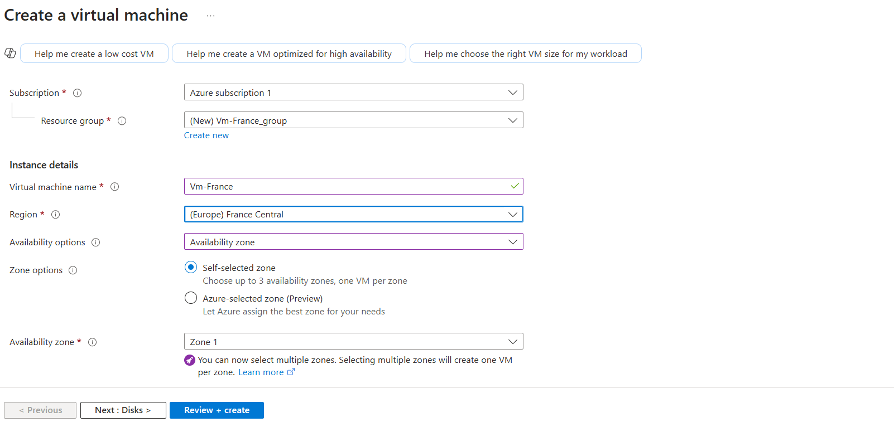
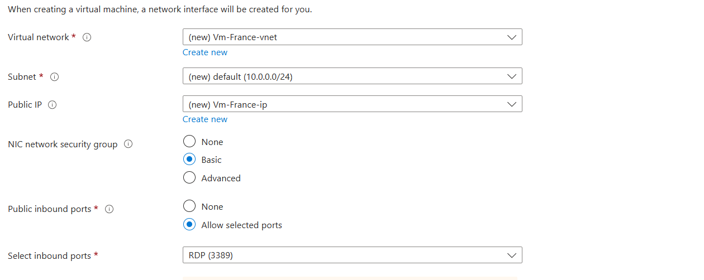
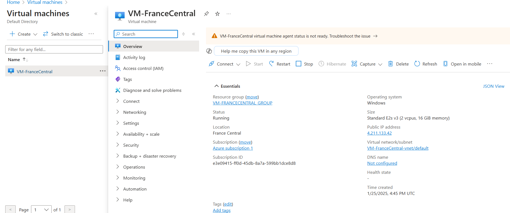
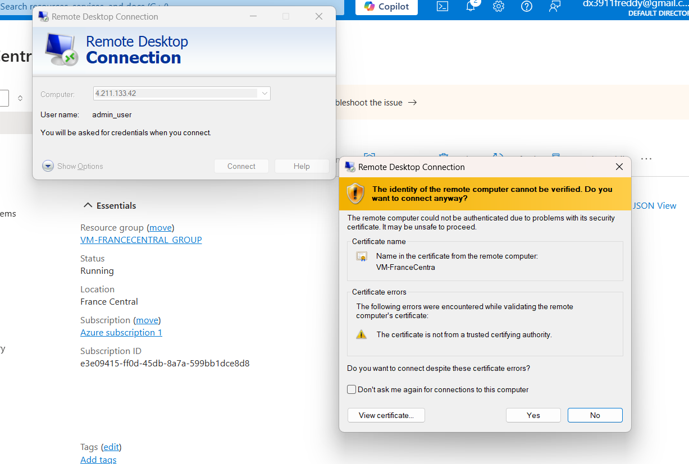
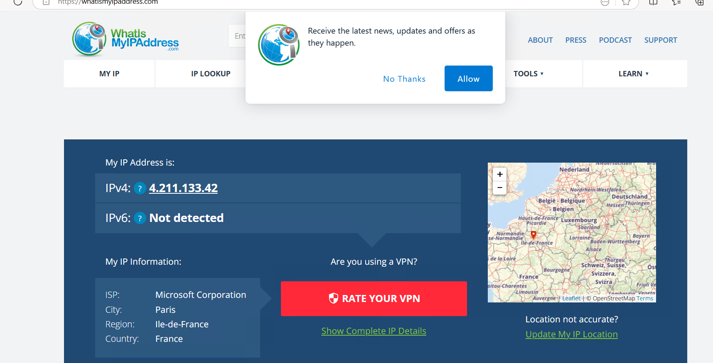
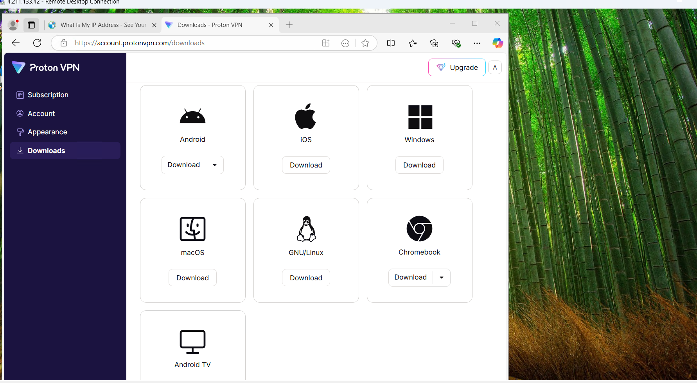
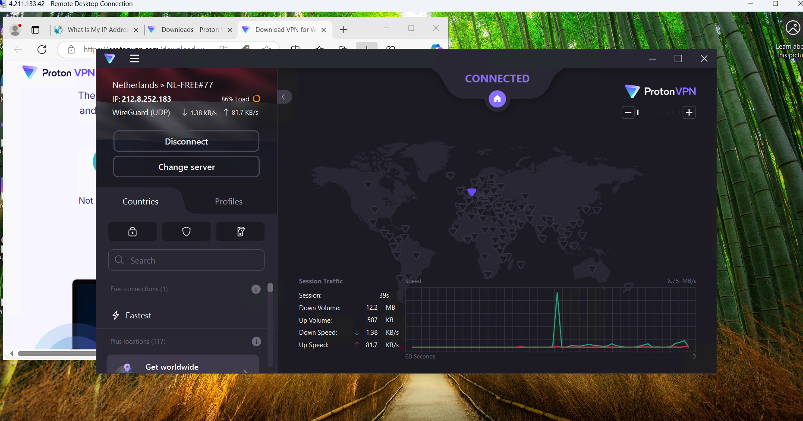
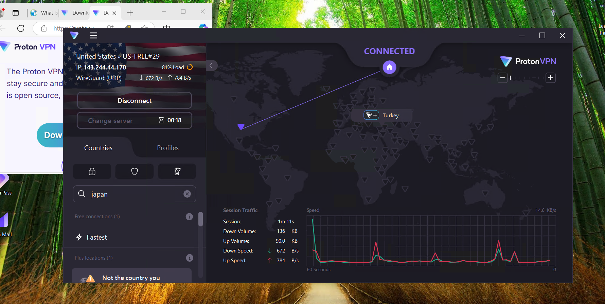
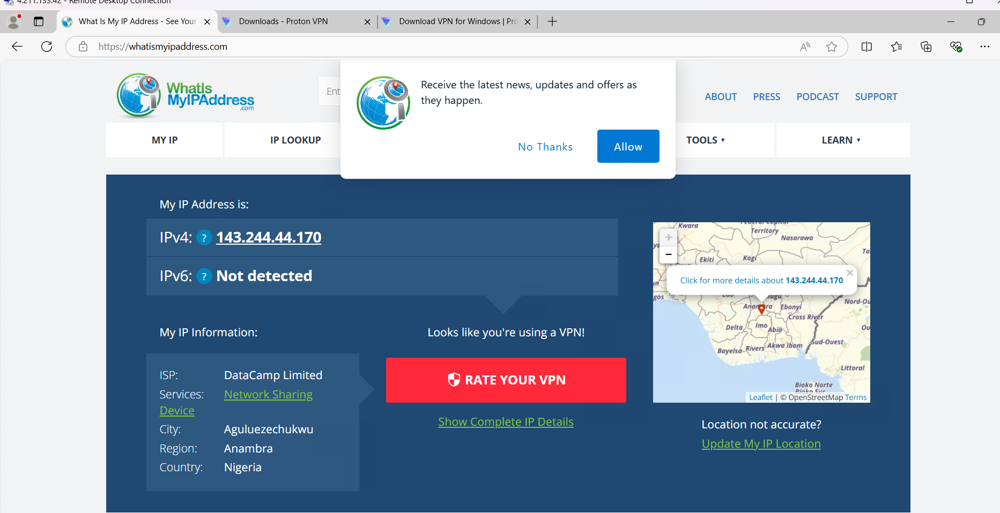

# Vitual Private Network (VPN)

<h1>VPN - Prerequisites and Installation</h1>
This tutorial outlines the prerequisites and installation of using a VPN. 

<h2>Environments and Technologies Used</h2>

- A VPN (Proton VPN)
- Microsoft Azure (Virtual Machines/Compute)
- Remote Desktop

<h2>Operating Systems Used </h2>

- Windows 10</b> (21H2)

<h2>STEPS INCLUDED</h2>

- STEP 1 - Locate Local IP
- STEP 2 - Setting Up VM Using Azure
- STEP 3 - Locating IP Through VM (France)
- STEP 4 - Connecting to VPN Through VM
- STEP 5 - Locating IP Through VPN (Africa)

<h2>Installation Steps</h2>

STEP 1 - Locate your own personal IP address by going to "www.whatismyipaddress.com" which will be able to show you your local IP address. We will use this later as well.

Next we will set up a virtual machine on Azure. 
  

 

STEP 2 - Go to www.portal.azure.com and find Virtual Machines. (Create a free account with $200 if you need to).

Creating the Virtual Machine as “VM-FranceCentral” and select that for the REGION as well. 

Select the “Networking” tab towards the top of the page and view EXAMPLE 2D inputs to match. 
  

 

Then select “Review and Create”, once it passes validation select “Create” at the bottom. 
  

 

NEXT: At the Virtual Machine we find that the IP to the Virtual Machine is “4.211.133.42”. 

STEP 3 – Log Into the VM and Find IP Address

Now that we have set up the Virtual Machine we will connecting to it using the application “Remote Desktop Connection” (EXAMPLE 3A) and input the IP address for the VM that we located in EXAMPLE 2E and then input the set credentials we set when creating the VM (see EXAMPLE 3B). Once logged in, we will open the web browser and again look up www.whatismyipaddress.com 

  

 

  

 

When we look up the IP address for this VM through www.whatismyipaddress.com we see that this VM is showing the location for France (EXAMPLE 3C).
  

 

EXAMPLE 3C

STEP 4 – CONNECTING TO VPN (Free Version)

Using the local computer go to protonvpn.com and create a free account (if you use the VM then French will display on your browser, so use local computer desktop). Once you are logged into your account, copy the URL from the Proton VPN website and then paste the URL to the VM web browser. 

  

 

Once you have logged into your Proton VPN account on the VM, you will select “Downloads” and choose to download the “Windows” version. Once the application Proton VPN is installed we will log in using the credentials we used when setting up a free account on Proton VPN. Then connect to the VPN through the installed app.
  

 

On the left hand side of the VPN you can select a country where you want your VPN to be, the image below shows the VPN being connected to an IP in USA. 
  

 

Next we will look at the IP again using the VM browser now that we have connected the VPN to USA/Nigeria. The website www.whatismyipaddress.com shows yet another IP address using the VPN from USA/Nigeria. This is quite amazing.
  

 

Looking at this exercise we see that we have utilized 3 different IP addresses just from your local computer to connect to the internet.
Home IP (USA): 137.103.51.136
Virtual Machine IP (France): 4.211.133.42
Virtual Machine IP VPN (USA/Nigeria) 143.244.44.170

  

 
Make sure to remove VM, from the Azure account for unwanted charges.

END OF TUTORIAL
